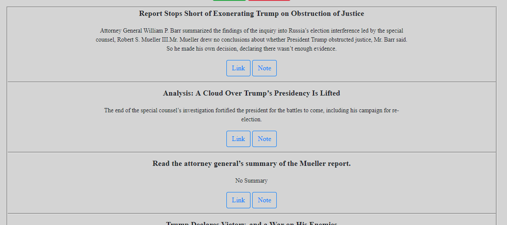
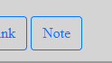

# Scrape News

    This application scrapes the front page of New York Times
    when user clicks "scrape!" button, then allows user to navigate
    to the article, or leave notes on each article.
    Click 'delete all' button to get rid of all articles.

1. Visit the url (https://tranquil-island-90281.herokuapp.com/)

2. Click Scrape! button

3. Watch the articles populate the screen
     Click on Link to visit the article!

4. Note button brings up area to type notes
